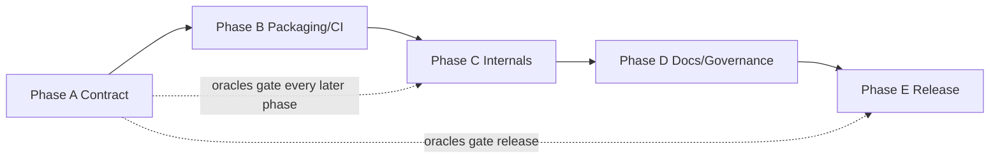

# PaDELPy: API-stable modernization of a Python wrapper for PaDEL-Descriptor

**Design Document — v0.1**
**Status:** Approved (2026-07-21)
**Package:** `padelpy` (PyPI / import name unchanged)
**License:** MIT (unchanged)
**Current release baseline:** `0.1.16` (2023-11-10)
**Modernization release tag:** `0.1.17` (after Phases A–E complete)

---

## 1. Summary

PaDELPy is a widely used Python wrapper around the Java [PaDEL-Descriptor](https://pubmed.ncbi.nlm.nih.gov/21425294/) command-line tool. It exposes a small public API (`from_smiles`, `from_mdl`, `from_sdf`, `padeldescriptor`) and ships the PaDEL JAR bundle so users do not install PaDEL separately.

The present work modernizes packaging, testing, CI, documentation, governance, and internal reliability **without changing the public API contract**. Downstream projects that import the current callables must continue to work with identical signatures, return shapes, and exception types. Descriptor numeric parity with the currently bundled PaDEL engine is treated as part of that contract for the `0.1.x` / `0.2.x` compatibility series.

This document is the design source of truth for a five-phase modernization program (Phases A–E) that raises the repository from thin MVP engineering toward production-stable open-source practice while preserving adoption.

---

## 2. Motivation and problem statement

### 2.1 Current landscape

Molecular descriptors and fingerprints remain standard inputs for QSPR/QSAR and cheminformatics machine-learning workflows. PaDEL-Descriptor calculates a large set of 1D/2D/3D descriptors and fingerprints and is still referenced in literature and pipelines. PaDELPy made that Java CLI accessible from Python with minimal friction and no hard Python dependencies beyond the standard library (plus a system Java JRE).

Empirically, the package is adopted (hundreds of GitHub stars, dozens of forks, ongoing issue traffic) but the repository engineering has lagged:

| Area | Current state (baseline `0.1.16` + tip) |
|------|----------------------------------------|
| Public API | Four callables; stable in practice |
| Tests | Four integration tests; ~68% line coverage; `from_mdl` untested |
| Tooling | Minimal `pyproject.toml`; no `[dev]`/`[docs]` extras; no ruff/pre-commit |
| Versioning | `padelpy/version.py` uses deprecated `pkg_resources` (broken on modern setuptools) |
| CI | Single Python 3.11 job on push; outdated Actions majors |
| Docs | README only; known typos; no Sphinx |
| Governance | No CONTRIBUTING, CHANGELOG, CITATION.cff, SECURITY, issue/PR templates |
| Internals | CWD temp files; string-built subprocess + `.split()`; busy-wait timeout |
| Publishing | Long-lived PyPI API token; ~21 MB wheel (vendored JARs) |

### 2.2 Why now

1. Downstream users rely on API stability; modernization debt increases the cost of every future bugfix.
2. Python packaging and setuptools have moved past `pkg_resources`; version introspection already fails in modern environments.
3. Open issues document reliability gaps (encoding, hangs, Java discovery, batch fingerprint limits, descriptor inconsistency) that require a regression harness before safe fixes.
4. A compatibility-preserving modernization is still cheaper than a rewrite or API break that would fragment the ecosystem.

### 2.3 Non-goals

The following are explicitly out of scope for this modernization program:

1. **Changing the public API** — no renamed callables, no required new arguments, no change to return container types (`dict`/`OrderedDict`/list-of-dicts) or primary exception types for documented failure modes.
2. **Replacing PaDEL with another descriptor engine** (RDKit, Mordred, etc.) as the default backend.
3. **Upgrading the bundled PaDEL/CDK JAR set** unless a separate major-version plan with dual-run numeric parity evidence is approved.
4. **Adding hard Python runtime dependencies** (RDKit, pandas, NumPy) to the default install.
5. **GPU acceleration**, web services, or a redesigned object-oriented calculator API (may be explored later as optional extras without replacing the frozen surface).
6. **JOSS resubmission** as a required deliverable of Phases A–E (citation metadata may still be added).

---

## 3. What's genuinely new

This program is an engineering modernization of an existing package, not a new descriptor algorithm. Differentiation relative to a rewrite or to alternative wrappers is:

1. **Frozen-contract modernization** — tooling, tests, CI, docs, and internals improve while `from_smiles` / `from_mdl` / `from_sdf` / `padeldescriptor` remain drop-in compatible.
2. **Descriptor-engine parity as a release gate** — golden oracles lock key counts and selected numeric values against the currently shipped PaDEL bundle before any internal change merges.
3. **Zero default Python deps preserved** — the install story (`pip install padelpy` + system Java) remains the primary path.
4. **Production packaging baseline** — modern `pyproject.toml` extras, coverage floor, multi-version CI, Sphinx, governance files, and trusted PyPI publishing without requiring users to change imports.
5. **Explicit stability policy** — additive kwargs and clearer error messages are allowed; behavior or JAR changes that alter descriptor outputs require a documented version bump strategy.

---

## 4. Goals

Numbered goals are testable exit criteria for the modernization program.

1. **G1 — API contract suite.** CI fails if public signatures change or if golden descriptor oracles for fixed SMILES/SDF/MDL fixtures regress beyond documented tolerances.
2. **G2 — Version and packaging.** `padelpy.__version__` resolves via `importlib.metadata`; `[dev]` and `[docs]` extras install; `python -m build` succeeds; classifiers include supported Python versions.
3. **G3 — Tooling and quality gates.** ruff lint/format, pytest-cov with an initial coverage floor of **≥90%** on Python package modules, and pre-commit are documented and enforced in CI.
4. **G4 — CI matrix.** Push/PR CI runs lint + tests on Python 3.11–3.13 with Java installed; coverage reported; Actions kept current.
5. **G5 — Internal reliability.** Temp files use secure temporary directories; subprocess uses an argv list and proper timeouts; CSV encoding failures raise clear errors of the existing exception family where applicable; CWD is not polluted on success paths.
6. **G6 — Documentation.** README corrected; Sphinx site with install + API autodoc builds with warnings as errors; Java prerequisite documented for current JREs.
7. **G7 — Governance.** CONTRIBUTING, CHANGELOG, CITATION.cff, SECURITY, and issue/PR templates present.
8. **G8 — Release path.** Trusted publishing (OIDC) replaces long-lived tokens; a compatibility release ships only after G1–G7 gates for that milestone, with all Phases A–E work verified locally and repository CI triggered by push to the release branch (§11.6).
9. **G9 — Issue triage readiness.** Top reliability issues have either a regression test + fix or a documented wontfix/limitation tied to PaDEL upstream behavior.

---

## 5. Target users and use cases

| User | Use case |
|------|----------|
| Cheminformatics / QSPR practitioner | Compute PaDEL descriptors or PubChem fingerprints from SMILES in a Python script or notebook |
| Pipeline author | Batch SDF/MDL files through `from_sdf` / `from_mdl` or `padeldescriptor` into CSV for model training |
| Library integrator | Depend on `padelpy` as a stable PyPI dependency without adapting to API churn |
| Maintainer / contributor | Run lint/tests locally and in CI; cut safe patch releases with changelog discipline |

**Primary constraint:** integrators must not need code changes when upgrading within the compatibility series.

---

## 6. Related work

| Project | What it does | Status | Gap this package fills |
|---------|--------------|--------|------------------------|
| [PaDEL-Descriptor](https://pubmed.ncbi.nlm.nih.gov/21425294/) (Yap, 2011) | Java GUI/CLI for ~1875 descriptors/fingerprints | Mature upstream; not a Python package | PaDELPy wraps the CLI for Python users and vendors the JAR |
| [Mordred](https://doi.org/10.1186/s13321-018-0258-y) | Pure-Python/RDKit descriptor calculator (~1800 descriptors) | Active alternative | Different engine and dependency stack; not a drop-in PaDEL substitute for pipelines locked to PaDEL features |
| RDKit descriptors / fingerprints | Core cheminformatics toolkit | De facto standard | Smaller / different descriptor set; not PaDEL-compatible outputs |
| Descriptastorus | RDKit-based descriptor generation + storage for ML | Active | Storage-oriented; not PaDEL CLI compatibility |
| padelpy2 (third-party) | Alternate PaDEL wrapper with RDKit/pandas-oriented API | Separate project | Different API; migrating would break existing padelpy callers |

**Primary literature for the engine (cite in docs/tests where descriptors are discussed):**

- Yap CW. PaDEL-Descriptor: An open source software to calculate molecular descriptors and fingerprints. *J Comput Chem.* 2011;32(7):1466-1474. DOI: [10.1002/jcc.21707](https://doi.org/10.1002/jcc.21707) / PMID: [21425294](https://pubmed.ncbi.nlm.nih.gov/21425294/).

PaDELPy itself does not invent new descriptors; citations belong on the wrapper’s reliance on PaDEL and on any fixture values taken from literature tables (none required for Phase A beyond engine self-consistency oracles).

---

## 7. Architecture overview

PaDELPy remains a **thin layered wrapper**. Modernization may refine module boundaries and helpers but must preserve the import surface.

```text
┌─────────────────────────────────────────────────────────┐
│  Public API (padelpy.__init__)                          │
│  from_smiles, from_mdl, from_sdf, padeldescriptor       │
│  (+ __version__)                                        │
└───────────────────────────┬─────────────────────────────┘
                            │
        ┌───────────────────┴───────────────────┐
        ▼                                       ▼
┌───────────────────────┐             ┌───────────────────────┐
│  L2 Convenience       │             │  L1 CLI wrapper       │
│  padelpy.functions    │────────────▶│  padelpy.wrapper      │
│  SMILES/MDL/SDF I/O   │             │  java -jar argv build │
│  CSV → dict rows      │             │  timeout / errors     │
└───────────────────────┘             └───────────┬───────────┘
                                                  │
                                                  ▼
                                      ┌───────────────────────┐
                                      │  L0 Bundled engine    │
                                      │  PaDEL-Descriptor.jar │
                                      │  + lib/*.jar (vendored)│
                                      └───────────────────────┘
```

**Dependency rule:** L2 may import L1; L1 must not import L2; neither layer imports application code outside the package. New helpers (e.g. temp-file utilities) live at L1/L2 without becoming public unless re-exported deliberately.

**Layout decision (approved):** Migrate to `src/padelpy/` in **Phase B**. The import name remains `import padelpy`. Package data must continue to ship the vendored `PaDEL-Descriptor/` tree in sdists and wheels. Packaging tests in Phase B verify JAR presence in the built wheel before the Phase E `0.1.17` release.

---

## 8. Core data model and public API

### 8.1 Frozen public surface

```python
from padelpy import from_smiles, from_mdl, from_sdf, padeldescriptor

# Version (to be exported after Phase B)
from padelpy import __version__
```

Signatures to preserve (keyword names and defaults must remain compatible; additive optional kwargs only):

```python
def from_smiles(
    smiles,  # str | list[str]
    output_csv: str | None = None,
    descriptors: bool = True,
    fingerprints: bool = False,
    timeout: int = 60,
    maxruntime: int = -1,
    threads: int = -1,
) -> OrderedDict | list: ...

def from_mdl(
    mdl_file: str,
    output_csv: str | None = None,
    descriptors: bool = True,
    fingerprints: bool = False,
    timeout: int = 60,
    maxruntime: int = -1,
    threads: int = -1,
) -> list: ...

def from_sdf(
    sdf_file: str,
    output_csv: str | None = None,
    descriptors: bool = True,
    fingerprints: bool = False,
    timeout: int = 60,
    maxruntime: int = -1,
    threads: int = -1,
) -> list: ...

def padeldescriptor(
    maxruntime: int = -1,
    waitingjobs: int = -1,
    threads: int = -1,
    d_2d: bool = False,
    d_3d: bool = False,
    config: str | None = None,
    convert3d: bool = False,
    descriptortypes: str | None = None,
    detectaromaticity: bool = False,
    mol_dir: str | None = None,
    d_file: str | None = None,
    fingerprints: bool = False,
    log: bool = False,
    maxcpdperfile: int = 0,
    removesalt: bool = False,
    retain3d: bool = False,
    retainorder: bool = True,
    standardizenitro: bool = False,
    standardizetautomers: bool = False,
    tautomerlist: str | None = None,
    usefilenameasmolname: bool = False,
    sp_timeout: int | None = None,
    headless: bool = True,
) -> None: ...
```

### 8.2 Return and error contracts

| Callable | Success return | Documented failure types (preserve) |
|----------|----------------|-------------------------------------|
| `from_smiles` | `OrderedDict` for one SMILES; `list` of row dicts for a list | `RuntimeError` on PaDEL/structure failure; type errors for bad `smiles` type |
| `from_mdl` / `from_sdf` | `list` of row dicts (Name column removed) | `ValueError` on bad extension; `RuntimeError` on empty/failed calculation |
| `padeldescriptor` | `None` | `ReferenceError` if `java` missing; `RuntimeError` on PaDEL stderr/timeout failure |

Descriptor values remain **strings as returned by PaDEL CSV** unless tests today coerce them; do not silently cast all fields to float (would be an API/behavior break for some consumers).

### 8.3 Stability policy

1. **Patch (`0.1.x`):** bugfixes, tooling, internal hardening, and docs that preserve the frozen API; descriptor oracles must match. This modernization program ships as **`0.1.17`** after Phases A–E.
2. **Minor (`0.2.0` and later):** reserved for future additive, still API-compatible work after `0.1.17`; oracles must match.
3. **Major (`1.0.0` or higher):** only after explicit stability promise; still preferably API-compatible. JAR upgrades or intentional descriptor-schema changes require dual-run evidence and a clear migration note.

---

## 9. Module design

### 9.1 `padelpy` (`__init__.py`)

**Purpose:** Re-export the public API and `__version__`.
**Changes:** Explicit `__all__`; version from `importlib.metadata` (with a safe editable-install fallback if needed).

### 9.2 `padelpy.functions`

**Purpose:** High-level SMILES/MDL/SDF convenience wrappers.
**Key behaviors to preserve:** three-attempt retry on `RuntimeError`; `maxruntime` seconds→milliseconds conversion; removal of `Name` column; list vs single return for SMILES.
**Internal improvements (Phase C):** tempfile-based `.smi`/`.csv` paths; robust cleanup on success and failure; encoding strategy for CSV reads (try UTF-8, fall back with a clear error).

### 9.3 `padelpy.wrapper`

**Purpose:** Build and run the PaDEL CLI.
**Key behaviors to preserve:** flag mapping to CLI switches; `headless` default `True`; `retainorder` default `True`.
**Internal improvements (Phase C):** argv list (no `command.split()`); `subprocess.run` / `Popen.communicate(timeout=...)` instead of busy-wait; preserve timeout error as `RuntimeError` with a stable message prefix where tests lock it.

### 9.4 `padelpy.version` (or inline version)

**Purpose:** Version string.
**Change:** Remove `pkg_resources`; prefer single source of truth in `pyproject.toml` via `importlib.metadata.version("padelpy")`.

### 9.5 Vendored `padelpy/PaDEL-Descriptor/`

**Purpose:** Ship the Java engine and licenses.
**Rule:** Treat as an opaque binary blob for Phases A–E. Do not upgrade JARs without a separate approved plan and parity corpus. Keep license files intact; document third-party licenses in user-facing docs.

---

## 10. Dependencies and ecosystem integration

| Kind | Decision |
|------|----------|
| Runtime Python deps | None (stdlib only) |
| System dep | Java JRE/JDK on `PATH` (`java` executable); document supported major versions (8+ recommended; historically “6+”) |
| Optional extras | `[dev]` — pytest, pytest-cov, ruff, pre-commit, build; `[docs]` — Sphinx, Furo, autodoc stack |
| Optional future extras (out of scope unless approved) | `[rdkit]` interop helpers that **call** the frozen API — must not replace it |
| Bundled artifacts | PaDEL JAR + libs (~20+ MB wheel) — accept size; document in README |

No Mordred/RDKit hard dependency will be introduced in the default install.

---

## 11. Validation strategy

### 11.1 Phase A — Contract suite (load-bearing)

| Test class | What | Pass criteria |
|------------|------|---------------|
| Signature locks | `inspect.signature` for four public callables | Exact parameter names + defaults |
| Golden oracles | Fixed SMILES (`CCC`, `CCCC`), `tests/aspirin_3d.sdf`, and an MDL fixture | Descriptor count (1875 for default descriptors), selected keys (`MW`, `nC`, …) within existing tolerances |
| Fingerprint mode | `fingerprints=True` / `descriptors=False` | Non-empty expected key subsets; no crash |
| Error paths | Invalid SMILES; bad extensions; missing Java (mocked `which`) | Correct exception types |
| `padeldescriptor` smoke | Minimal mol_dir + d_file | Exit without raising; CSV produced |

Store oracle fixtures under `tests/fixtures/` with a short README stating they are engine self-consistency references for the **bundled** PaDEL version, not independent literature tables (unless later expanded).

### 11.2 Unit vs integration

- **Unit:** argv construction, temp-file helpers, extension validators, version resolution (mock subprocess / filesystem).
- **Integration:** real Java + PaDEL runs (marked `@pytest.mark.integration` if needed; required in CI where Java is installed).

### 11.3 Coverage

- CI floor (Phases A–B onward): **90%** line coverage on Python package modules (`src/padelpy/**/*.py` after the layout migration).
- Unit tests with mocked subprocess are expected to cover wrapper flag branches and error paths so the 90% floor is reachable without exercising every PaDEL CLI combination against Java.
- JAR bytecode is out of coverage scope.

### 11.4 Numerical tolerances

Public numeric checks use `pytest.approx` with tolerances consistent with current tests (e.g. `MW` to `1e-4` relative/absolute as today). Descriptor CSV strings may be compared as strings or parsed floats at assertion time only.

### 11.5 Docs / notebooks

- Sphinx `-W` build in CI after Phase D.
- Optional single example notebook under `examples/` demonstrating `from_smiles` (smoke via nbmake only if added; not a Phase A blocker).

### 11.6 Local verification and CI gates

**Local-first (Phases A–E):** All phase work must be completed and verified **locally** before any push intended for release. Agents and maintainers treat local commands as the definition of done for each phase exit (lint, tests + coverage, docs build once Sphinx exists, `python -m build` when packaging is in scope). Do not rely on remote CI to discover failures during A–E implementation.

**Remote CI (release branch):** The repository CI workflow (lint + test matrix + docs when present) is expected to run when changes are **pushed to the release branch**. That push is a confirmation gate after local verification, not a substitute for it. Release workflow builds artifacts and publishes via OIDC.

---

## 12. Open-source packaging

| Concern | Decision |
|---------|----------|
| Build backend | setuptools (current) via `pyproject.toml`; keep unless hatchling migration is zero-risk |
| Layout | `src/padelpy/` in Phase B (required before the `0.1.17` release) |
| Python versions | `requires-python = ">=3.11"`; CI on 3.11, 3.12, 3.13 |
| Java (CI) | Eclipse Temurin 17; document runtime requirement as Java 8+ |
| License | MIT (project) + retain PaDEL/CDK third-party license files in the bundle |
| Docs | Sphinx + Furo under `docs/source/`; Read the Docs config |
| CI | `.github/workflows/ci.yml` — lint + test matrix; Java setup action |
| Release | Tag/release-triggered publish with PyPI trusted publishing |
| Governance | CONTRIBUTING, CODE_OF_CONDUCT, CHANGELOG, SECURITY, issue/PR templates |
| Citation | `CITATION.cff` pointing at the GitHub repo and PaDEL primary paper as related reference |
| Supply chain | Pin GitHub Actions to full SHAs or current majors with Dependabot; no secrets in repo; drop long-lived PyPI token |

---

## 13. Roadmap (Phases A–E)

Phases map to implementation milestones. The sole PyPI tag for this program is **`0.1.17`**, cut in Phase E after Phases A–D exit. Intermediate work stays on the `0.1.16` tip (no interim tags). **All Phases A–E work must be done and verified locally** (§11.6); repository CI runs when the completed work is pushed to the release branch.

| Phase | Theme | Primary goals | Suggested version |
|-------|-------|---------------|-------------------|
| **A** | Freeze the contract | G1 — golden oracles, signature locks, `from_mdl` coverage; path to **90%** coverage | Commits on `0.1.16` tip (no tag) |
| **B** | Modernize the shell | G2, G3, G4 — `src/` layout, packaging, ruff, 90% coverage gate, CI matrix (Py 3.11–3.13 + Temurin 17), `__version__` | Commits on tip (no tag) |
| **C** | Harden internals | G5, G9 — tempfile, subprocess, encoding, issue-driven fixes behind oracles | Commits on tip (no tag) |
| **D** | Docs and maintainer surface | G6, G7 — README fixes, Sphinx, governance files | Commits on tip (no tag) |
| **E** | Compatibility release | G8 — trusted publishing; changelog; tag and publish **`0.1.17`** | Tag **`0.1.17`** after A–D; later `1.0.0` only with explicit stability promise |

### 13.1 Phase A — Freeze the contract

**Intent:** Make unsafe refactors detectable and establish the 90% coverage baseline before layout/tooling moves.

Deliverables:

1. Expand `tests/` with signature, oracle, fingerprint, and error-path coverage including `from_mdl`.
2. Add unit tests with mocked subprocess/filesystem so wrapper and helper branches count toward the **90%** floor without requiring every CLI flag against live Java.
3. Add fixtures + short fixture card (engine version note).
4. Document stability policy in `API_STABILITY.md` (migrate into Sphinx in Phase D).

**Exit:** Local `pytest` green with coverage ≥90% on package modules; oracles recorded.

### 13.2 Phase B — Modernize the shell

**Intent:** Bring packaging and CI to current scientific Python norms without logic rewrites.

Deliverables:

1. Migrate package tree to `src/padelpy/` (including vendored PaDEL bundle); verify wheel contains JARs.
2. `pyproject.toml` extras (`[dev]`, `[docs]`), classifiers for 3.11–3.13; leave package version at `0.1.16` until Phase E.
3. Fix version import (`importlib.metadata`); export `__version__`.
4. ruff + pre-commit + coverage config with **90%** fail-under gate.
5. Replace/extend `run_tests.yml` with a proper CI workflow (PR + push; Python 3.11–3.13; Temurin 17).

**Exit:** Locally, `pip install -e ".[dev]"` works; ruff + pytest with coverage ≥90% pass; CI workflow files are present and correct for the release-branch matrix (3.11–3.13 + Temurin 17); ready for Phases C–E. Remote CI confirmation occurs when pushed to the release branch (§11.6).

### 13.3 Phase C — Harden internals

**Intent:** Fix reliability bugs without changing call signatures or oracle outputs.

Deliverables:

1. Tempfile-based I/O and cleanup.
2. Argv-based subprocess + real timeouts.
3. Encoding-safe CSV read path.
4. Regression tests for fixed issues (Unicode paths/content, timeout behavior, Java-missing message).
5. Do **not** upgrade JARs.

**Exit:** Oracles unchanged; targeted issue reproductions pass or are closed as upstream-limited with docs.

### 13.4 Phase D — Docs and maintainer surface

**Intent:** Make the project maintainable and approachable.

Deliverables:

1. README corrections (SDF example bug, license badge, Java links, contact).
2. Sphinx install + API pages; `.readthedocs.yaml`.
3. CONTRIBUTING, CHANGELOG, CITATION.cff, SECURITY, CODE_OF_CONDUCT, templates.

**Exit:** `sphinx-build -W` passes; governance checklist complete.

### 13.5 Phase E — Compatibility release (`0.1.17`)

**Intent:** Ship the completed modernization (Phases A–D) to PyPI as a single compatibility release.

Deliverables:

1. Confirm Phases A–D are **locally verified** (lint, tests + coverage, docs `-W`, build) per §11.6.
2. Refresh publish workflow (prefer trusted publishing / OIDC if credentials allow; otherwise document token path).
3. Bump version to **`0.1.17`**, write CHANGELOG covering contract suite, packaging/CI, internal hardening, and docs/governance.
4. Push the release-ready commit(s) to the **release branch** so repository CI triggers; proceed to tag and publish only after local verification is complete (and after CI on the release branch is green when that push is used).
5. Post-release: monitor issues; plan a future `1.0.0` only after sustained stability (out of scope for this program).

**Exit (0.1.17):** Phases A–E work done and verified locally; release-branch CI has run (when pushed); PyPI artifact installable; smoke test from clean venv + Java; Phase A oracles pass on the release commit.



---

## 14. Open questions

### 14.1 Resolved (2026-07-21)

| # | Decision |
|---|----------|
| Q1 | Migrate to `src/padelpy/` in **Phase B** (required before the `0.1.17` release). |
| Q2 | Tag **`0.1.17`** once as the final modernization release after Phases A–E; no interim tags (`0.1.18` / `0.2.0`) in this program. |
| Q4 | Document Java 8+; CI uses **Eclipse Temurin 17**. |
| Q7 | Initial coverage floor is **90%** on Python package modules. |

### 14.2 Still open

| # | Question | Options | Recommendation | Owner |
|---|----------|---------|----------------|-------|
| Q3 | Should stderr-only PaDEL messages continue to raise `RuntimeError` even when descriptors succeed? | Keep current strictness vs refine with oracle-guarded heuristics | Keep strictness until reproductions prove false positives; then refine behind tests (Phase C) | Maintainer |
| Q5 | Enable Windows/macOS CI runners? | Ubuntu-only vs multi-OS | Ubuntu required for `0.1.17`; add macOS/Windows later if needed | Maintainer |
| Q6 | Is padelpy2 interop or competition messaging needed in README? | Ignore / brief “related projects” note | Brief related-projects note in Phase D; no disparagement | Maintainer |

---

## Appendix A — Mapping audit findings to phases

| Finding | Phase |
|---------|-------|
| Missing API/oracle tests; `from_mdl` untested | A |
| Broken `pkg_resources` version; no extras; no ruff | B |
| Thin CI; Actions drift; no coverage gate | B |
| CWD temps; `command.split()`; timeout loop; encoding issues | C |
| README bugs; no Sphinx; no governance files | D |
| Token-based PyPI publish; unreleased tip commits | E |
| Bundled JAR upgrade pressure | Explicit non-goal (future major plan) |

## Appendix B — Approval checklist

- [x] Maintainer approves API freeze and non-goals (§2.3, §8)
- [x] Maintainer answers Q1, Q2, Q4, Q7 (`src/` in B; single tag `0.1.17` after A–E; Temurin 17; 90% coverage)
- [x] Design accepted → create implementation blueprint
- [x] Execute Phase A first (start with contract fixtures / signature locks)
- [ ] No implementation of B–E until Phase A oracles exist (recommended gate)
- [ ] All Phases A–E work done and verified locally before release push (§11.6)
- [ ] Tag `0.1.17` only when Phases A–D exit criteria pass and release-branch CI has been triggered by push (Phase E)
